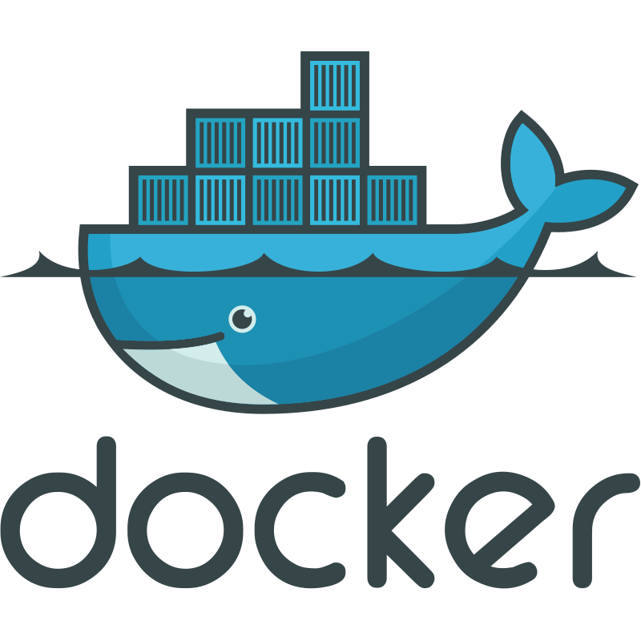
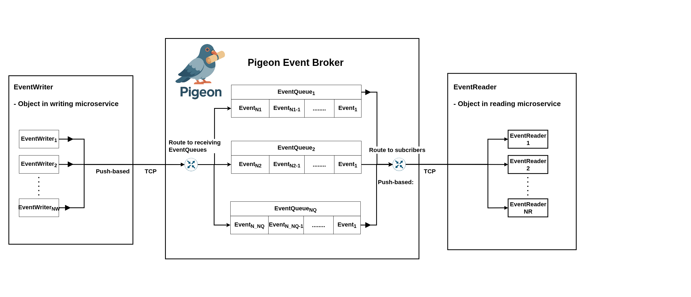
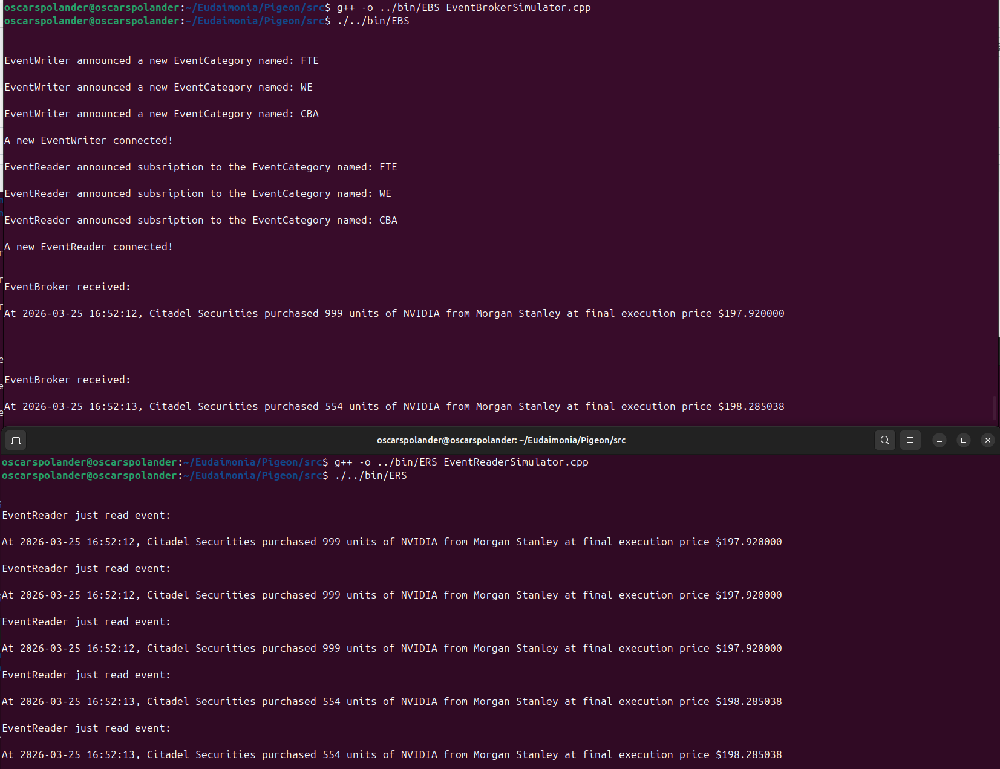

# What it is
Message broker for event-driven software systems.

The goal of this project is **not** to build a serious substitute to Kafka, but rather to learn what engineering constraints emerge when building a message broker from scratch. This activity should yield insights about the inner workings of Kafka and other message brokers. Much of the architecture is drawn from that of Kafka, but then implemented in C++.

# Status
Experimental - Core features yet to be built. Minimal existing functionality.

## What exists today
* **Core event broker skeleton**
  * Event broker server with in-memory queues concurrently accepting/transmitting events over TCP from/to EventWriters/EventReaders.
* **Event Activity simulator**
  * Event activity simulator propagating fictional financial trading events from EventWriter(s) -> Event Broker (EventQueue(s)) -> EventReader(s)
  * See the section named _Event Activity Simulator_ below
* **Binary communication protocol for Events transmitted over TCP**
  * Structural encoding in EventBroker.
  * See documentation/Protocol.md for more details.
* **Event Category Partitions**
  * Analogous to Kafka topics.
  * EventWriters/EventReaders announce to the EventBroker the set of EventCategories they write/subscribe to/from, following their TCP handshake that establishes network communication.
* **Architecture and design records**
  * Exploratory architecture diagrams and written design notes capturing the current structure of the system and the design questions being investigated.
  * These are intentionally included early in order to make the architectural reasoning transparent, even as the implementation is evolving.

## What does not exist today
* **Log-based event brokerage.**
  * Established systems such as Kafka use space locality on the disk as an append-only log to achieve an attractive combination of performance and resilliance (Kleppmann, 2017). In contrast, Pigeons' in-flight events are currently held in queues in memory. This means that events are lost in case of broker failure, in contrast to Kafka where events are persisted on disk.
* **No sharding of EventQueue categories.**
    * Kafkauesque partitioning of EventCategories across their storage areas is currently missing.
* **Delivery guarantuees.**
  * Pigeon currently offers no excactly-once or other delivery guarantuees for written events.
  * Pigeon is currently susceptible to possible losses or duplication of events in case of various errors such as network glitches or other failures.
* **Event Replay (recovery)**
  * Pigeon currently offers no recovery mechanism from system disaster by replaying events that were in-flight at the time of failure.
* **Horizontal scaling logic**
  * Pigeon currently has no support for scaling/replicating event brokers to up/down-scale bandwidth under variable throughput load, beyond what could be offered by default in Kubernetes deployments that respond to variable network traffic in/out from event broker(s).
* **Performance tuning**
  * No deliberate performance tuning or benchmarking has been done yet.
  

# Tech stack
* Programming language - C++ 20
  * gcc compiler
* UNIX Socket API
* Containerization - Docker

  &nbsp;&nbsp;&nbsp;&nbsp;&nbsp;&nbsp;&nbsp;&nbsp;&nbsp;&nbsp;&nbsp;&nbsp;&nbsp;&nbsp;&nbsp;&nbsp;&nbsp;&nbsp;  

# How to use

Using Pigeon amounts to

* Defining custom event structures as raw C-structs.
  * These must adhere to the struct Event, found in Event.hpp.
  * EventWriters and EventReaders that share a given EventCategory must agree upon the custom Event format, so that data is preserved in-flight.
  * See example in src/FinancialTradingEvent.hpp.
* Specify and announce targets and subscriptions for EventWriters and EventReaders respectively.
  * See EventWriter::announceEventCategories(2) and EventReader::subscribeToEventCategories(2)
* Embedding EventWriter and EventReader objects in your C++ code. Insert Event writes and Event reads at relevant points in your application. 
* Deploying the Pigeon event broker server alongside your existing microservices, including those now containing the EventWriters and EventReaders.
* The deployed Pigeon event broker now processes events in (near) real-time, meaning that the EventQueues residing in the Pigeon event broker receives messages from EventWriters, and propagates them onto subsribing EventReaders.

# Architecture

Architectural diagrams are continously modified to reflect changes.

## Engineering Problems
This section delineates some (but certainly not all) engineering problems and tradeoffs which are adressed by a desirable event broker design.
* **Sufficient throughput**
  * Especially for high-load Event Queues.
* **Tradeoff between periodic event polling and latency.**
* **Fast multicasting/ fan-out of events.**
* **Replay of lost events.**
  * Related: persisting events
* **Heterogenous load (event spikes)**
*  **Arrival guarantuees of events**

And more.

# Event Activity Simulator

Three source code files, **_EventBrokerSimulator.cpp_**, **_EventWriterSimulator.cpp_**, and **_EventReaderSimulator.cpp_** together make up an **_event activity simulator_** as part of the Pigeon Project. Its purpose is twofold:
* Performing experiments on the Pigeon event broker by exposing it to realistic event activity which is generated at the EventWriter, using stochastic processes where necessary.
* Demonstrating Pigeon.

A fictional financial trading event type is used for simulation purposes, found in _**src/simulator/FinancialTradingEvent.hpp**_.

## Using the Event Activity Simulator

You can run the Event Activity Simulator in one of two ways:
1. Docker
   1. Suitable if you don't run a UNIX-based OS, since the Docker containers do.
2. Compile and run locally (demands dependencies, see below).

**1.Docker**

To run the Event Activity Simulator with docker compose, execute

_**docker compose -f simulator-compose.yml up**_

while standing in the folder _**src**_. This will
1. Build three docker images (Broker, Writer, Reader).
2. Start the Broker first, Writer second, and Reader third.

You should now see event activity logging in the Broker and Reader as they receive fictional financial trading events originating from the writer.

**2. Locally**

The event activity simulator is used locally by running the following three commands in order from one terminal each, while standing in the folder _src/simulator_.

* In the first terminal, navigate to src/simulator, then run

   _**g++ -std=c++20 -o ../../bin/EBS -I.. EventBrokerSimulator.cpp**_

  followed by
  
  _**./../../bin/EBS**_
* In the second terminal, navigate to src/simulator, then run
  
  _**g++ -std=c++20 -o ../../bin/EWS -I.. EventWriterSimulator.cpp**_
  followed by
  
  _**./../../bin/EWS**_
* In the third terminal, navigate to src/simulator, then run
  
  _**g++ -std=c++20 -o ../../bin/ERS -I.. EventReaderSimulator.cpp**_
  
  followed by
  
  _**./../../bin/ERS**_ 

Example terminal output for EventBroker and EventReader:

# Dependencies
Running the Pigeon event broker server as well as the simulator requires present installations of the following softwares:
* gcc compiler version 13.3.0
  * Compile with -std=C++20
* Operating System - Ubuntu 24.04.1
  * For UNIX Socket API support.
  * The UNIX Socket API has support on all Unix machines, including macOS.
 
# Why?
Why do message brokers exist? Why not forego the intermediate layer, and instead send data straight from sender to receiver in a peer-to-peer network? Below are some attempts at answering such questions, found when reflecting upon texts such as those by _Kleppman, 2017_, and _Gorton, 2022_.

# Existential Purpose of message brokers
* **Reusability**
  * Less manual labour compared to case-by-case implementation of real-time communication pattern.
* **Orthogonality**
  * Decoupling of teams working on different reader/writer microservices.
  * Microservices become liberated from their mutal dependencies, reducing coordination costs in updates and changes.
* **Resillience**
  *  Message brokers buffers failures between reader/writers, allowing the other side to stay operational.
    * For log-based message brokers such as Kafka, additional resilience is gained by virtue of using the (persistent) disk as the event write destination.
  * The broker acts as a record of written events enabling **_replay_** of lost messages in failure scenarios.
* **Insight extraction (Business)**:
  * Using the broker to categorize system events can support data analytics and ML pipelines.
* **Scalability**
  * The broker can, if designed to buffer differentials in read/write throughputs, decouple horizontal scaling of event readers and event writers. Coupling writers to readers with direct network communication demand that they scale in sync - not always cost-optimal in a Kubernetes cluster when readers and writers put varying demands on the system as a whole. For example, a single event writer might write events that will be read by 100 subscribing event readers. Then you get a differential of 1/100, and a one-one scaling of writers/readers would be immensely wasteful. An event broker handling the fan-out is much more (cost) effective.
